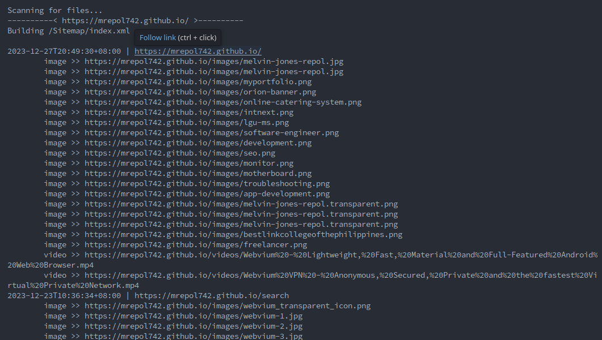
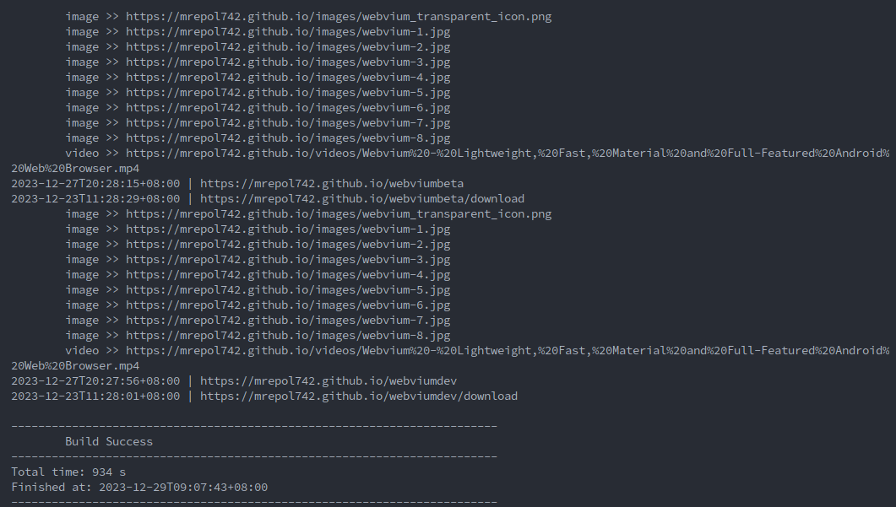

# Sitemap-Generator

Automatically generate Sitemap for static websites.





## Requirements
- maven
- Java 8

## Build
```
mvn compile assembly:single
```

## Run
```
java -cp target/Sitemap-Generator-1.0-jar-with-dependencies.jar com.mrepol742.sitemapgenerator.App --domain https://mrepol742.github.io/ --publisher "Melvin Jones Repol"
```

## Options
```
--domain 
--publisher
--projectFolder [optional]
```